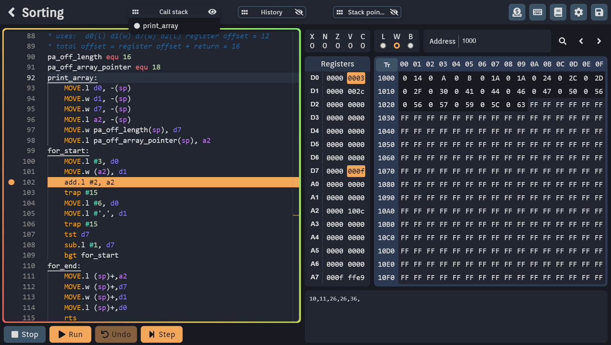

# Asm editor 

A webapp made with [sveltekit](https://kit.svelte.dev/) and [rust](https://www.rust-lang.org/it) webassembly to write and run m68k assembly code.
Uses monaco-editor for the editor, and my [WASM M68K interpreter](https://github.com/Specy/s68k) to run the code

## Features 
* Simple code completition and full syntax highlighting
* Run the program or step through it
* Code breakpoints, settings, input/output interrupts, undo, formatter and more
* Inspect the value of each register and memory address to see which was changed with each instruction
* Create new projects and manage them all in the webapp 
* Integrated IDE with semantic checks and useful errors to help you learn assembly
* Integrated documentation and intellisense with addressing modes, descriptions and examples
* Customisable settings and shortcuts, including theme customization
